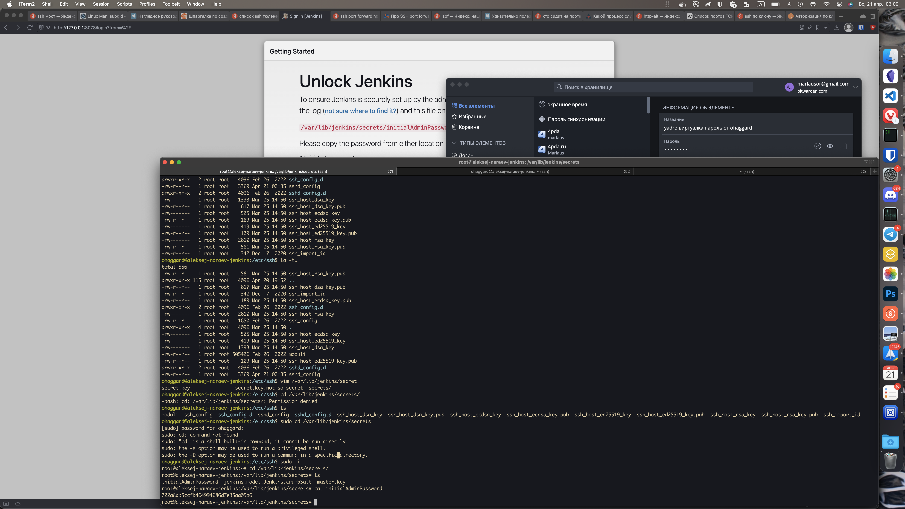
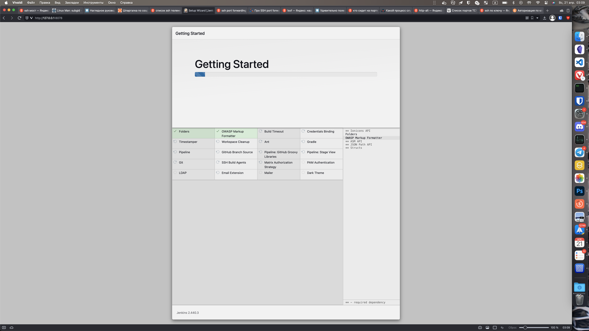
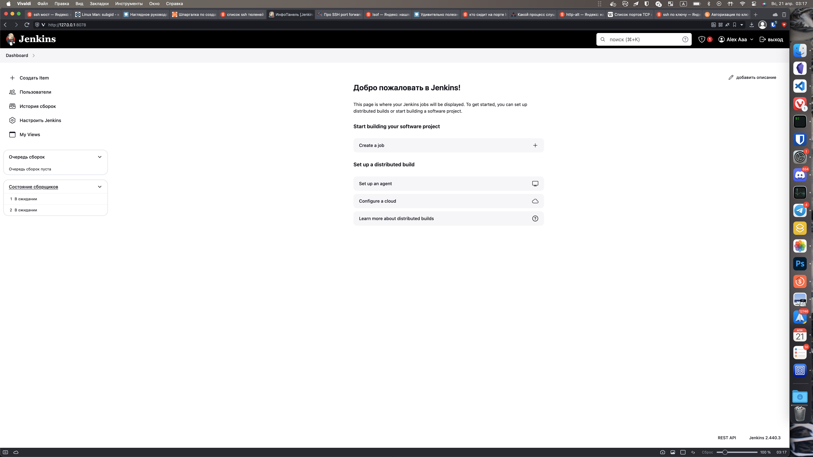
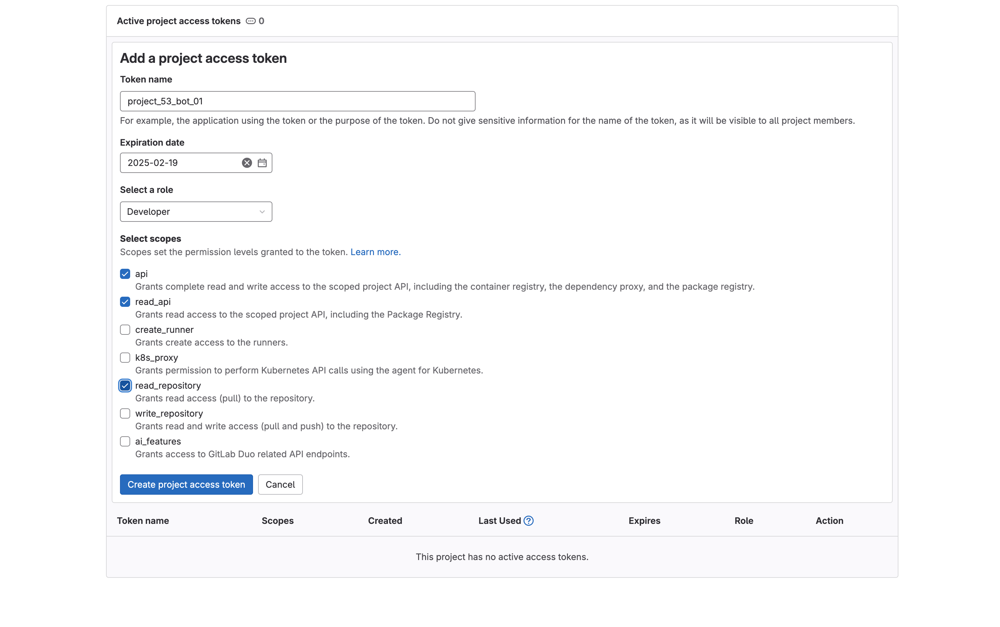
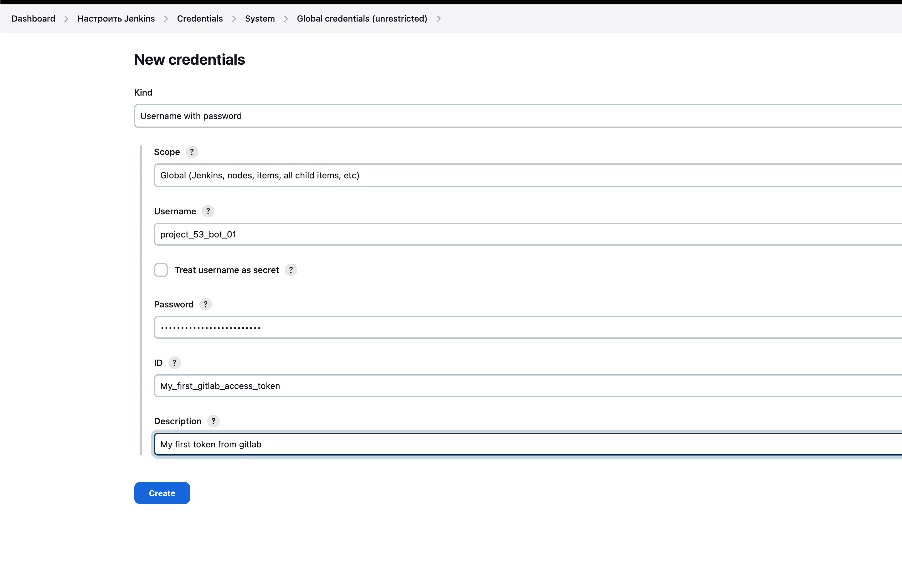
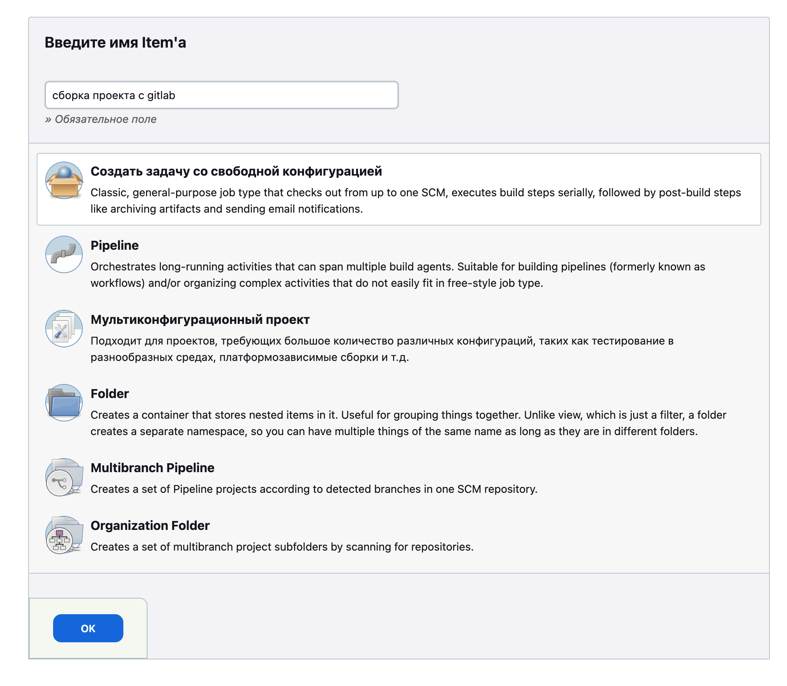

# Подключение к vm и проброска портов
```bash
ssh  -L 8078:127.0.0.1:8080 <username>@178.170.197.115 -p 22002
```

# Первоначальная настройка vm
## Создаем пользователя
```bash
useradd ohaggard
passwd ohaggard
adduser ohaggard sudo
usermod ohaggard -s /bin/bash
mkhomedir_helper ohaggard
```
После чего перезаходим в новосозданного пользователя

# Установка jenkins
Не вижу смысла описывать полную установку, т.к. весь процесс описан на сайте разработчика. Однако стоит упомянуть пару необходимых моментов

## remapping uid and gid
```bash
echo jenkins:10000:65536 >> /etc/subgid
echo jenkins:10000:65536 >> /etc/subuid
```
Эти действия необходимо сделать во имя избежания ошибки на этапе сборки контейнера jenkins-ом. Физический смысл этой команды заключается в том, что процессы созданные пользователем jenkins и группой jenkins будут ремапиться таким образом, что внутри процесса pid будет отображаться как 0, тогда как снаружи как 10000 и т.д. вплоть до 65536. Сделано это для предотвращения атаки с повышением привелегии. Даже если взломщик получит доступ к процессу с pid 0 внутри контейнера, он все еще ничего не сможет сделать т.к. снаружи контейнера его pid будет равен 10000. 

## Добавление аккаунта docker в buildah
Важный момент. Список контейнеров в buildah уникален для каждого пользователя. Также как и учетные данные удаленного репозитория. Зайдя в аккаунт docker.io под одним пользователем, он все еще не будет доступен под другим пользователем. Для решения этой проблемы нужно зайти под учеткой jenkins, и там пройти регистрацию в buildah. 
```bash
sudo su - jenkins
buildah login docker://docker.io/repository/docker/patchking #Дописываю этот момент после того как сделал всю работу. Не помню, как точно указывать репозиторий
```


# Настройка jenkins
## Первоначальная настройка jenkins
Получение секрета для первого входа в консоль


## Установка рекомендованных плагинов и главное окно


## Создание access токена для репозитория gitlab и добавление его в jenkins


## Создание задачи со свободной конфигурацией

### Стратегия хранения сборок
Я ограничил время и количество хранимых сборок докерконтйенера

### Настройка параметризированной сборки
Я объявляю переменные среды как параметры. При сборки они будут включены в процесс сборки как переменные среды. Насколько я понимаю, buildah подтянет переменные среды в контейнер автоматически.


### Настройка интеграции с git
В выпадающем списке **Credentials** используется раннее объявленные секретики. В качестве ветки для сборки указал текущую рабочую ветку.

### Настройка автоматического опроса SCM о наличии изменений
Каждые 20 минут jenkins опрашивает SCM о наличии изменений в ветке. Если они есть, пулит и выполняет задачу.

### Команда для сборки проекта


# Быстрый ответ на содержание слайда "На что обратить внимание"

**Удалять устаревшие билды** - было реализовано в задаче

**Разрешить параллельный запуск задачи** - Не использовал в связи с отсутствием необходимости. Но надеюсь разобраться с этим во время создания полноценного пайплайна :)

**Branch Specifier (blank for 'any')** - было реализовано в задаче

**Trigger builds remotely (e.g., from scripts)** - разобрался как работает, но не смог реализовать. Для нормальной работы вебхуков нужно либо пробрасывать порты через ssh между машиной с gitlab и виртуалкой, либо иметь в наличии больше одного порта. Думаю при большом желании можно что-то накостылить, но заниматься этим я не стал.

**Запускать периодически** - было реализовано в задаче

**Use secret text(s) or file(s)** - было реализовано в задаче. Секреты были использованы в двух местах: при указании access token к гитлаб и api_key в настройках параметрической сборки

**Опрашивать SCM об изменениях** - было реализовано в задаче. Jenkins опрашивает SCM каждые 20 минут
